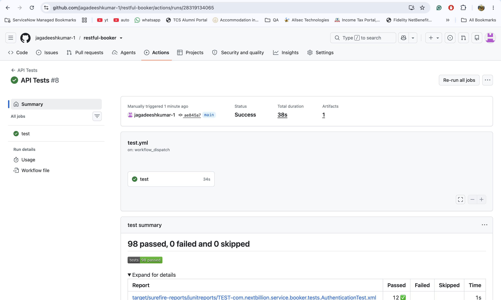
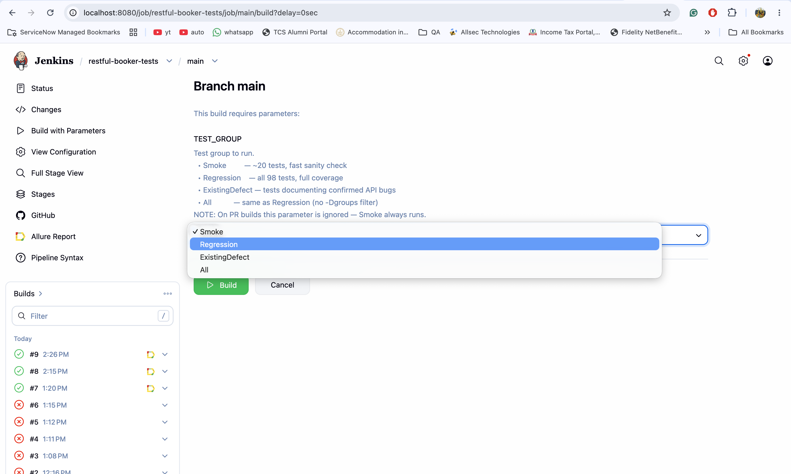
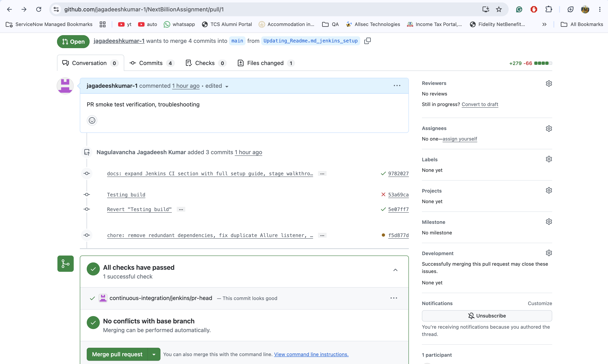
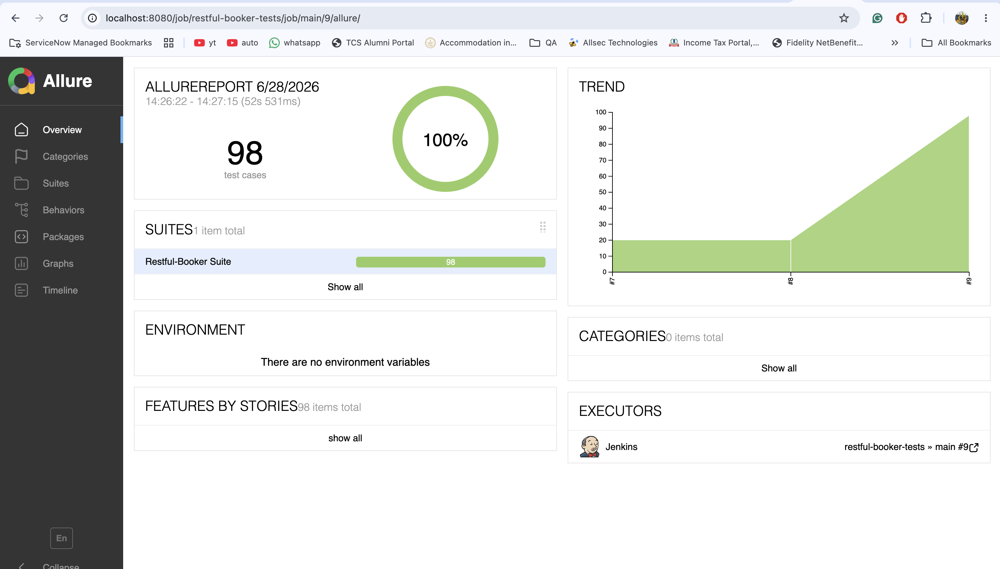

# Restful Booker API Test Suite

A comprehensive REST API test automation framework for the [Restful Booker](https://restful-booker.herokuapp.com) API, built with **Java + Rest Assured + TestNG + Maven**.

> **Average suite execution time: ~46 seconds** (measured over 5 runs with parallel execution, 98 tests)

---

## Table of Contents

1. [Technology Stack](#technology-stack)
2. [Prerequisites](#prerequisites)
3. [Project Structure](#project-structure)
4. [Framework Architecture](#framework-architecture)
5. [Configuration](#configuration)
6. [How to Run Tests](#how-to-run-tests)
7. [Test Groups (Tags)](#test-groups-tags)
8. [Test Coverage](#test-coverage)
9. [Confirmed API Defects](#confirmed-api-defects)
10. [Design Decisions](#design-decisions)
11. [CI / CD](#ci--cd)
12. [AI Tool Usage](#ai-tool-usage)
13. [What I'd Do Next](#what-id-do-next)

---

## Technology Stack

| Tool | Version | Purpose |
|------|---------|---------|
| Java | 17 | Language |
| Maven | 3.x | Build & dependency management |
| Rest Assured | 5.4.0 | HTTP client for API testing |
| TestNG | 7.9.0 | Test framework & runner |
| Jackson | 2.17.1 | JSON serialization / deserialization |
| Lombok | 1.18.32 | Eliminates boilerplate getters/setters in model classes |
| Hamcrest | 2.2 | Assertion matchers |
| Allure TestNG | 2.27.0 | Test result collection for HTML reports |
| Allure Maven | 2.12.0 | Generates interactive HTML report (`mvn allure:serve`) |
| Maven Surefire | 3.2.5 | Test execution plugin |

---

## Prerequisites

- **Java 17+** installed and `JAVA_HOME` set
- **Maven 3.6+** installed and available on `PATH`
- Internet access to reach `https://restful-booker.herokuapp.com`

Verify your environment:
```bash
java -version   # should print 17 or higher
mvn -version    # should print 3.6 or higher
```

---

## Project Structure

```
NextBillionAssignment/
├── .github/
│   └── workflows/
│       └── test.yml                                 # GitHub Actions CI workflow
├── Jenkinsfile                                      # Jenkins Multibranch Pipeline (optional)
├── pom.xml                                          # Maven build + all dependencies
└── src/
    └── test/
        ├── java/
        │   └── com/nextbillion/
        │       ├── base/
        │       │   └── BaseTest.java                # Abstract base — Rest Assured config, request spec
        │       ├── core/
        │       │   └── ApiClient.java               # Generic HTTP methods (GET, POST, PUT, PATCH, DELETE)
        │       └── service/
        │           └── booker/
        │               ├── BookerBaseTest.java       # Booker-specific setup (base URI, client init)
        │               ├── BookingApiClient.java     # All Booker API calls (create, get, update, delete, auth)
        │               ├── model/
        │               │   ├── Booking.java          # Request/response POJO for booking body
        │               │   ├── BookingDates.java     # Nested POJO for checkin/checkout dates
        │               │   └── BookingResponse.java  # POJO for POST /booking response (id + booking)
        │               └── tests/
        │                   ├── BookingLifecycleTest.java  # E2E: POST→GET→PUT→PATCH→DELETE — 1 test
        │                   ├── AuthenticationTest.java    # POST /auth — 12 tests
        │                   ├── CreateBookingsTest.java    # POST /booking — 37 tests
        │                   ├── GetBookingByIdTest.java    # GET /booking & GET /booking/{id} — 13 tests
        │                   ├── UpdateBookingsTest.java    # PUT & PATCH /booking/{id} — 16 tests
        │                   ├── DeleteBookingsTest.java    # DELETE /booking/{id} — 13 tests
        │                   └── IdempotencyTest.java       # Idempotency for all CRUD ops — 6 tests
        └── resources/
            ├── config.properties                    # Default base URI setting
            └── testng.xml                           # Test suite definition with parallel execution
```

---

## Framework Architecture

### How It Works (Layer by Layer)

```
Test Class  →  BookingApiClient  →  ApiClient  →  Rest Assured  →  API
```

**1. `BaseTest` (abstract)**
Configures the global Rest Assured request specification — sets base URI, Content-Type, Accept header, and Jackson as the JSON serializer. Uses a Template Method pattern: subclasses must implement `resolveBaseUri()`.

**2. `BookerBaseTest`**
Extends `BaseTest`. Resolves the Booker base URI from (in priority order):
1. System property: `-Dbooker.base.uri=...`
2. Environment variable: `BOOKER_BASE_URI`
3. `config.properties` on the classpath
4. Hardcoded fallback: `https://restful-booker.herokuapp.com`

Instantiates `BookingApiClient` in `@BeforeSuite`, then immediately calls `GET /ping`. If the API responds with anything other than HTTP 201, the suite aborts immediately with a clear `[HealthCheck] FAILED` message — preventing 95 misleading failures when the API is simply unreachable.

**3. `ApiClient`**
Generic HTTP client with methods for `get()`, `post()`, `put()`, `patch()`, `delete()`. Uses Jackson's `ObjectMapper` to explicitly serialize all request bodies to JSON strings before sending — this ensures consistent wire serialization regardless of the Rest Assured version.

**4. `BookingApiClient`**
Booker-specific API client. Wraps `ApiClient` with domain-specific methods:
- `createBooking(Booking)` — POST and deserialize response to `BookingResponse`
- `createBookingRaw(Object)` — POST and return raw `Response` (used for negative tests)
- `getBookingById(int)` — GET /booking/{id}
- `getAllBookings()` / `getBookings(Map)` — GET /booking with optional filters
- `updateBooking(id, Booking, token)` — PUT with Cookie auth
- `partialUpdateBooking(id, Map, token)` — PATCH with Cookie auth
- `deleteBooking(id, token)` — DELETE with Cookie auth
- `ping()` — GET /ping (health check)
- `createToken(username, password)` — POST /auth
- `getValidToken()` — cached token helper
- `createDefaultBooking()` / `createAndGetId()` — setup helpers for tests

**5. Model Classes (`Booking`, `BookingDates`, `BookingResponse`)**
Plain Java POJOs annotated with Lombok `@Data`, `@NoArgsConstructor`, and `@AllArgsConstructor`. Lombok generates all getters, setters, `equals`, `hashCode`, and `toString` at compile time — no boilerplate needed. Field names exactly match the API's JSON keys so no `@JsonProperty` annotations are required.

---

## Configuration

The base URI is resolved automatically. You do not need to edit any file to run the suite.

| Source | How to Set |
|--------|-----------|
| System property | `mvn test -Dbooker.base.uri=https://restful-booker.herokuapp.com` |
| Environment variable | `export BOOKER_BASE_URI=https://restful-booker.herokuapp.com` |
| config.properties | Edit `src/test/resources/config.properties` |
| Default fallback | Already set to `https://restful-booker.herokuapp.com` |

---

## How to Run Tests

```bash
# Run the full test suite (98 tests)
mvn test

# Run only Smoke tests (20 tests — fast sanity check after deployment)
mvn test -Dgroups=Smoke

# Run full Regression suite (all 98 tests)
mvn test -Dgroups=Regression

# Run only tests that document confirmed API defects
mvn test -Dgroups=ExistingDefect

# Run a specific test class
mvn test -Dtest=BookingLifecycleTest
mvn test -Dtest=CreateBookingsTest

# Override the base URI at runtime
mvn test -Dbooker.base.uri=https://your-staging-api.example.com
```

Test reports are generated in `target/surefire-reports/` after each run.

---

## Test Groups (Tags)

Every test method is tagged with one or more of the following TestNG groups:

| Tag | Meaning | Count |
|-----|---------|-------|
| `Smoke` | Happy-path positive tests — run these for a quick sanity check after a deployment | 20 |
| `Regression` | All tests — run the full suite for thorough regression coverage | 98 |
| `ExistingDefect` | Tests that document a confirmed bug in the API — the test passes (documents actual behavior) but the API behavior is incorrect | 21 |

**Note on `ExistingDefect` tests:** These tests are written to *pass* against the current (buggy) API behavior. Their purpose is to document the defect so that when the API is fixed, the test will fail — alerting the team that the known bug has been resolved and the assertion should be updated to the correct expectation.

---

## Test Coverage

### End-to-End Lifecycle (`BookingLifecycleTest` — 1 test)

| Test | Groups | What It Verifies |
|------|--------|-----------------|
| `fullBookingLifecycle_createGetPutPatchDelete` | **Smoke**, Regression | POST → GET → PUT → PATCH → DELETE on the **same booking ID**, response verified at every step |

---

### Authentication (`AuthenticationTest` — 12 tests)

| Test | Groups | What It Verifies |
|------|--------|-----------------|
| `validCredentials_returnsToken` | **Smoke**, Regression | Valid admin credentials return a non-empty token |
| `wrongPassword_returnsBadCredentials` | Regression, **ExistingDefect** | Wrong password → 200 + "Bad credentials" (defect: should be 401) |
| `wrongUsername_returnsBadCredentials` | Regression, **ExistingDefect** | Wrong username → 200 + "Bad credentials" (defect: should be 401) |
| `bothWrongCredentials_returnsBadCredentials` | Regression, **ExistingDefect** | Both wrong → 200 + "Bad credentials" (defect: should be 401) |
| `missingPassword_returnsBadCredentials` | Regression, **ExistingDefect** | Missing password field → 200 + "Bad credentials" (defect: should be 400) |
| `missingUsername_returnsBadCredentials` | Regression, **ExistingDefect** | Missing username field → 200 + "Bad credentials" (defect: should be 400) |
| `emptyBody_returnsBadCredentials` | Regression, **ExistingDefect** | Empty body → 200 + "Bad credentials" (defect: should be 400) |
| `singleCharCredentials_returnsBadCredentials` | Regression | Single char credentials → rejected |
| `veryLongUsername_doesNotCrashServer` | Regression | 1000-char username → no 500 crash |
| `xssInUsername_noTokenIssued` | Regression | XSS payload in username → no token issued |
| `sqlInjectionInPassword_noTokenGranted` | Regression | SQL injection in password → no token issued |
| `jsonInjectionInCredentials_authNotBypassed` | Regression | JSON injection in credentials → no token issued |

---

### Create Booking (`CreateBookingsTest` — 37 tests)

**Positive (5 tests — Smoke + Regression)**
- Full round-trip: all fields returned correctly in response
- Created booking is retrievable by its returned ID
- `depositpaid=false` is persisted correctly
- Zero price accepted and round-trips correctly
- Very long `additionalneeds` string handled gracefully

**Negative — Missing required fields (6 tests)**
Each test removes one required field (`firstname`, `lastname`, `totalprice`, `depositpaid`, `bookingdates`) and verifies a 4xx or 418 error is returned.

**Negative — Wrong types / Defects (9 tests — Regression + ExistingDefect)**

| Test | Defect |
|------|--------|
| `totalprice` as non-numeric string | Accepted with 200 — no type validation |
| `totalprice` as float 99.99 | Accepted with 200 — integer field accepts floats |
| `depositpaid` as string `"true"` | Accepted with 200 — no boolean type enforcement |
| `depositpaid` as integer `1` | Accepted with 200 — no boolean type enforcement |
| `bookingdates` as flat string | Crashes server → **500** (should be 400) |
| `firstname` as JSON `null` | Crashes server → **500** (null bypasses JS typeof check) |
| empty string `firstname` | Accepted with 200 — no minimum length validation |
| `bookingdates` missing `checkin` | Crashes server → **500** (sub-fields not validated) |
| `bookingdates` missing `checkout` | Crashes server → **500** (sub-fields not validated) |

**Boundary (2 tests)** — Same dates, max int price

**Security (4 tests)** — XSS, SQL, JSON, null-byte injection in fields

**Date format variations (8 tests)** — ISO-8601 with time, slash-separated, DD-MM-YYYY, MM/DD/YYYY, long-form month, Unix timestamp, far-future (2099), historical (1900). All accepted verbatim — API has no date format validation.

---

### Get Booking (`GetBookingByIdTest` — 13 tests)

| Test | Groups | What It Verifies |
|------|--------|-----------------|
| `getById_returnsAllCreatedFields` | **Smoke**, Regression | Full data round-trip — all fields match what was created |
| `getAllBookings_returnsNonEmptyList` | **Smoke**, Regression | GET /booking returns a non-empty list |
| `getAllBookings_eachItemHasBookingIdField` | **Smoke**, Regression | Each item in the list has a positive integer `bookingid` — verifies the response structure from the API docs |
| `multipleCreatedBookings_allAppearInList` | Regression | Creates 3 distinct bookings and asserts all 3 IDs appear in GET /booking |
| `filterByName_includesCreatedBooking` | **Smoke**, Regression | Filter by firstname+lastname returns matching booking |
| `filterByCheckin_includesMatchingBooking` | **Smoke**, Regression | Filter by checkin date returns matching booking |
| `filterByCheckout_includesMatchingBooking` | **Smoke**, Regression | Filter by checkout date returns matching booking |
| `getNonExistentId_returns404` | Regression | Non-existent ID → 404 |
| `filterByUnknownName_returnsEmptyList` | Regression | Filter with no matching name → empty list |
| `getZeroId_returnsSafeError` | Regression | ID=0 → safe 400 or 404 |
| `getNegativeId_returnsSafeError` | Regression | ID=-1 → safe 400 or 404 |
| `filterWithXssInName_returnsSafeResponse` | Regression | XSS in filter param → safe response |
| `filterWithSqlInName_returnsSafeResponse` | Regression | SQL injection in filter param → safe response |

---

### Update Booking (`UpdateBookingsTest` — 16 tests)

**Positive PUT (2 tests — Smoke + Regression)**
- `putWithValidToken_replacesAllFields` — All fields replaced, response reflects new values
- `putChange_persistsOnSubsequentGet` — Change verified by a subsequent GET

**Positive PATCH (2 tests — Smoke + Regression)**
- `patchWithValidToken_updatesOnlySuppliedFields` — Only supplied fields change; untouched fields remain
- `patchChange_persistsOnSubsequentGet` — Partial change verified by a subsequent GET

**Negative (6 tests)** — No token → 403, fake token → 403, non-existent ID (defect tests below)

| Test | Groups | Defect |
|------|--------|--------|
| `putOnNonExistentId_returns405` | Regression, **ExistingDefect** | Returns 405 Method Not Allowed — should be 404 Not Found |
| `patchOnNonExistentId_returns405` | Regression, **ExistingDefect** | Returns 405 Method Not Allowed — should be 404 Not Found |

**Boundary (2 tests)** — `putZeroPrice_isAccepted`, `patchEmptyBody_doesNotCrash`

**Security (4 tests)** — `putWithXssInFirstname_storedAsPlainText`, `putWithSqlInjectionInLastname_doesNotCrash`, `patchWithXssInFirstname_handledSafely`, `patchWithJsonInjectionInNotes_doesNotBreakResponse`

---

### Delete Booking (`DeleteBookingsTest` — 13 tests)

| Test | Groups | What It Verifies |
|------|--------|-----------------|
| `deleteWithValidToken_returns201` | **Smoke**, Regression, **ExistingDefect** | Deletion succeeds — **defect: returns 201 Created instead of 200/204** |
| `deletedBooking_isNoLongerRetrievable` | **Smoke**, Regression | Deleted booking returns 404 on GET |
| `deletedBooking_removedFromList` | **Smoke**, Regression | Deleted booking absent from GET /booking list |
| `deleteWithoutToken_returns403` | Regression | No token → 403 |
| `deleteWithoutToken_doesNotRemoveBooking` | Regression | Unauthorized delete does not remove the booking |
| `deleteWithInvalidToken_returns403` | Regression | Fake token → 403 |
| `deleteWithEmptyToken_returns403` | Regression | Empty string token → 403 |
| `deleteNonExistentId_returns405` | Regression, **ExistingDefect** | Non-existent ID → **defect: 405 instead of 404** |
| `doubleDelete_returns405` | Regression, **ExistingDefect** | Re-delete → **defect: 405 instead of 404** |
| `deleteZeroId_returnsSafeError` | Regression | ID=0 → safe error |
| `deleteNegativeId_returnsSafeError` | Regression | ID=-1 → safe error |
| `deleteWithXssToken_returns403` | Regression | XSS payload as token → 403 |
| `deleteWithSqlToken_returns403` | Regression | SQL injection as token → 403 |

---

### Idempotency (`IdempotencyTest` — 6 tests)

Verifies HTTP idempotency semantics (RFC 7231) for every CRUD operation.

| Test | Groups | What It Verifies |
|------|--------|-----------------|
| `get_calledTwice_returnsSameData` | Regression | GET called twice returns identical response — read idempotency |
| `put_samePayloadTwice_returnsSameResponse` | Regression | PUT with same payload twice returns identical responses |
| `put_samePayloadTwice_serverStateUnchanged` | Regression | GET after two identical PUTs reflects the same resource state |
| `patch_fixedValueTwice_serverStateUnchanged` | Regression | PATCH with same fixed value twice leaves the resource unchanged |
| `delete_calledTwice_secondCallReturns405InsteadOf404` | Regression, **ExistingDefect** | **Defect:** Second DELETE returns 405 instead of 404 — DELETE must be idempotent per RFC 7231 |
| `post_samePayloadTwice_createsTwoDistinctBookings` | Regression | Two identical POSTs create two different booking IDs — POST is non-idempotent by design |

---

## Confirmed API Defects

The following defects were identified and documented with the `ExistingDefect` group tag. **These tests pass** — they assert the current (incorrect) API behavior to detect regressions. When the API is fixed, these tests will fail, prompting you to update the assertion to the correct expected behavior.

| # | Endpoint | Defect | Correct Behavior | Affected Tests |
|---|---------|--------|-----------------|---------------|
| 1 | `POST /auth` | Returns **HTTP 200** for all auth failures | Should return **401** for wrong credentials, **400** for missing fields | 6 auth tests |
| 2 | `DELETE /booking/{id}` | Returns **HTTP 201 Created** for successful delete | Should return **200 OK** or **204 No Content** | `deleteWithValidToken_returns201` |
| 9 | `DELETE /booking/{id}` | **Not idempotent** — second DELETE returns 405 instead of 404 | Should return **404 Not Found** on subsequent calls (RFC 7231 §4.2.2) | `delete_calledTwice_secondCallReturns405InsteadOf404` |
| 3 | `PUT /booking/{id}`, `PATCH /booking/{id}`, `DELETE /booking/{id}` | Returns **405 Method Not Allowed** for non-existent resource | Should return **404 Not Found** (the method IS allowed; the resource does not exist) | 4 tests |
| 4 | `POST /booking` | **500 Internal Server Error** when `bookingdates` sub-fields (`checkin`/`checkout`) are missing | Should return **400 Bad Request** with a validation error message | 2 tests |
| 5 | `POST /booking` | **500 Internal Server Error** when `bookingdates` is sent as a string instead of an object | Should return **400 Bad Request** | 1 test |
| 6 | `POST /booking` | **500 Internal Server Error** when `firstname` is JSON `null` | Should return **400 Bad Request** (null bypasses JS `typeof undefined` check) | 1 test |
| 7 | `POST /booking` | Accepts **wrong types** for `totalprice` (string, float) and `depositpaid` (string, integer) without error | Should return **422 Unprocessable Entity** or **400 Bad Request** | 4 tests |
| 8 | `POST /booking` | Accepts **empty string** for `firstname` | Should return **400 Bad Request** (minimum length validation missing) | 1 test |

---

## Design Decisions

### Why Rest Assured?
Industry-standard Java library for REST API testing. Provides a fluent DSL that reads like a specification: `given → when → then`.

### Why pin `ObjectMapperType.JACKSON_2` in `BaseTest`?
This config in `initSuite()`:
```java
RestAssured.config = RestAssuredConfig.config()
        .objectMapperConfig(ObjectMapperConfig.objectMapperConfig()
                .defaultObjectMapperType(ObjectMapperType.JACKSON_2));
```
controls how Rest Assured **deserializes** response bodies when you call `.extract().as(SomeClass.class)`. Without it, Rest Assured scans the classpath and picks a JSON library in this order: **Jackson 2 → Gson → Jackson 1 → JAXB**. Jackson 2 is your only JSON library right now, so it would be chosen automatically — but if any future dependency pulls in Gson as a transitive library, Rest Assured would silently switch to it, breaking deserialization. This line pins the choice explicitly so the behaviour is immune to classpath changes.

Note: this config is for **deserialization only** (response → Java object). Serialization (Java object → request JSON) is handled separately by `ObjectMapper.writeValueAsString()` in `ApiClient.toJson()`.

### Why explicit Jackson serialization in `ApiClient`?
Rest Assured's serialization behavior can vary depending on which libraries are on the classpath (it may fall back to Groovy's `JsonOutput`). To guarantee consistent, predictable JSON on the wire, `ApiClient` uses `ObjectMapper.writeValueAsString()` to serialize all request bodies explicitly before passing them to Rest Assured.

### Why `Accept: application/json` (not `ContentType.JSON`)?
The Restful Booker API returns **HTTP 418 I'm a Teapot** when the `Accept` header contains anything other than plain `application/json`. Rest Assured's `ContentType.JSON` expands to a multi-value header (`application/json, */*`) which the API rejects. Setting the header as a plain string fixes this.

### Why Lombok on model classes?
The three model classes (`Booking`, `BookingDates`, `BookingResponse`) previously contained ~60 lines of hand-written getters, setters, and constructors. Lombok's `@Data` + `@NoArgsConstructor` + `@AllArgsConstructor` replaces all of that with 3 annotations, making the classes easier to read and maintain. Jackson uses the no-arg constructor for deserialization and the setters generated by `@Data`.

### Why no `@JsonProperty` annotations?
The Java field names in all three model classes exactly match the JSON keys returned by the API (`firstname`, `lastname`, `totalprice`, `depositpaid`, `bookingdates`, `checkin`, `checkout`, `bookingid`, `booking`). Jackson's default naming strategy maps them correctly without any annotation. `@JsonProperty` is only needed when field names differ from JSON keys.

### Why does `ApiClient` have two `post()` overloads with different return types?
`ApiClient` exposes two signatures for `POST` (and similarly for other mutating methods):

```java
// 1. Raw — caller owns all decisions
Response post(String path, Object body)

// 2. Typed convenience — status asserted internally, body deserialized
<T> T post(String path, Object body, int expectedStatus, Class<T> responseType)
```

| | `Response post(...)` | `<T> T post(...)` |
|---|---|---|
| Status assertion | Caller does it | Done internally |
| Deserialization | Caller does it | Done internally via Jackson |
| Return type | Always `Response` | Typed `T` (compile-time safe) |
| Used by | Negative / boundary / security tests | Positive happy-path tests |

**Why not just one?**
- If only the typed version existed, negative tests could never run — the method would throw an assertion error the moment the status code didn't match `expectedStatus`, making it impossible to test 403/404/500 responses.
- If only the raw version existed, every positive test would need 3 extra lines to assert status + deserialize + cast — repeated boilerplate across dozens of tests.

The two overloads are a deliberate split: **raw access for tests that need control**, **typed convenience for tests that don't**.

### Why separate `createBookingRaw()` and `createBooking()` methods?
`createBooking(Booking)` always deserializes the response into a `BookingResponse` object — ideal for positive tests that need to assert on the returned booking ID or field values. `createBookingRaw(Object)` returns the raw `Response` object — ideal for negative tests where the body might not be a valid `BookingResponse` (e.g., error responses or 500 crashes).

### Why a dedicated `BookingLifecycleTest`?
Each unit test class creates its own independent booking — no single existing test exercises the full CRUD chain on one resource. `BookingLifecycleTest` fills this gap: one test, one booking ID, all five operations verified in sequence. It is the primary `Smoke` signal — if it fails, something fundamental is broken.

### Why `IdempotencyTest` as a separate class?
Idempotency is a cross-cutting concern, not tied to any single endpoint. Grouping all checks in one file makes them easy to run independently and reason about together. The DELETE defect (405 on second call) is restated here from the idempotency angle to make the RFC 7231 violation explicit.

### Why `@BeforeSuite` health check instead of `@BeforeClass`?
A single `@BeforeSuite` ping in `BookerBaseTest` runs once before the entire parallel suite. If the API is down, the suite aborts immediately with `[HealthCheck] FAILED — HTTP <status>`. Using `@BeforeClass` would repeat the check 7 times unnecessarily.

### Test Group Strategy
- **`Smoke`** — 20 tests (lifecycle + all positive happy-path tests). Run after every deployment for a fast pass/fail signal.
- **`Regression`** — All 98 tests. Run for full coverage before releases.
- **`ExistingDefect`** — 21 tests documenting confirmed API bugs. Useful for tracking defect resolution — if a fix is deployed, these tests will fail (correctly) and the assertion must be updated.

### Why three separate model classes instead of one?
The API returns two structurally different JSON shapes that cannot be represented by a single flat class:
- **`BookingDates`** — required because `bookingdates` in the JSON is a **nested object** (`{"checkin": "...", "checkout": "..."}`). Jackson maps nested objects to separate Java types. Flattening `checkin`/`checkout` directly into `Booking` would break the JSON nesting on the wire.
- **`BookingResponse`** — required because the POST /booking response wraps the booking inside a `booking` key alongside a top-level `bookingid`. This is a completely different shape from the GET/PUT/PATCH body and cannot be represented by the same class.
- **`Booking`** — the shared core, used as both the request body for POST/PUT/PATCH and the response body for GET/PUT/PATCH.

They could be written as inner static classes in one file, but every type reference becomes more verbose (`BookingModel.Booking`, `BookingModel.BookingDates`) with no functional gain. Three separate files is standard Java/Jackson convention.

### Average Execution Time
Measured over 5 full runs (95 tests at time of measurement; 3 additional GET /booking tests added since, `parallel="true" thread-count="10"`):

| Run | Time elapsed |
|-----|--------------|
| 1   | 49.90 s      |
| 2   | 42.42 s      |
| 3   | 42.48 s      |
| 4   | 46.59 s      |
| 5   | 48.10 s      |
| **Average** | **~46 s** |

### Parallel Execution
`testng.xml` runs tests with `parallel="true" thread-count="10"`. Each test creates its own booking data (never shares IDs between tests) so there are no race conditions.

---

## CI / CD

This project supports **two CI options**: GitHub Actions (primary) and Jenkins (optional).

---

### GitHub Actions

The workflow is defined in `.github/workflows/test.yml`.

> 📎 **Live proof:** [GitHub Actions run #28319134065](https://github.com/jagadeeshkumar-1/restful-booker/actions/runs/28319134065) — real workflow execution showing all steps passing.



#### Workflow triggers

| Trigger | When it fires | Test group |
|---------|--------------|------------|
| `pull_request` | PR opened/updated against `main` | **Smoke** (forced) |
| `push` | Code pushed to `main` | **Smoke** |
| `workflow_dispatch` | Manual trigger from Actions tab | User's choice (`Smoke`, `Regression`, `ExistingDefect`, `All`) |

#### Step-by-step breakdown

| # | Step | What it does |
|---|------|-------------|
| 1 | **Checkout code** | Clones the repository into the runner using `actions/checkout@v4` |
| 2 | **Set up JDK 17** | Installs Temurin JDK 17 and caches Maven dependencies for faster subsequent runs |
| 3 | **Resolve test group** | Determines which test group to run — forces `Smoke` for PRs and pushes, uses the selected group for manual triggers |
| 4 | **Run tests** | Executes `mvn clean test -Dgroups=<group>` to run the TestNG suite; `continue-on-error: true` ensures reporting steps still run even if tests fail |
| 5 | **Publish test results** | Parses Surefire JUnit XML reports and posts them as a GitHub Check with pass/fail counts visible on the PR |
| 6 | **Generate Allure report** | Converts raw `target/allure-results/` JSON into an interactive HTML report |
| 7 | **Upload Allure report** | Uploads the generated Allure HTML report as a downloadable build artifact (retained for 30 days) |

#### To run tests manually via GitHub Actions

1. GitHub repo → **Actions** tab → **API Tests** workflow
2. Click **Run workflow** → select branch and `test_group`
3. Click **Run workflow** button

#### To view the Allure report from GitHub Actions

1. Click into the completed workflow run
2. Scroll to **Artifacts** → download `allure-report`
3. Unzip and open `index.html` directly in your browser — the report is generated as a **single self-contained HTML file** so no local server is needed

---

### Jenkins Setup (optional)

A `Jenkinsfile` is also provided for teams using Jenkins. It uses a **Multibranch Pipeline** job.

### What it does automatically
- Every **pull request** → runs **Smoke** tests (forced, ~20 tests, ~30s)
- Every **branch push** → runs whichever `TEST_GROUP` you select (default: `Smoke`)
- If any test fails → Jenkins marks build **UNSTABLE** → GitHub blocks the PR merge
- After every run → generates an **Allure HTML report** visible inside Jenkins

---

### Jenkinsfile — stage by stage walkthrough

```groovy
pipeline {
    agent any          // run on any available Jenkins node

    parameters {
        choice(name: 'TEST_GROUP',
               choices: ['Smoke','Regression','ExistingDefect','All'])
        // Only used for manual builds. PRs always force Smoke (see below).
    }

    tools {
        maven 'Maven'  // Jenkins resolves mvn from Manage Jenkins → Tools → Maven
    }

    options {
        timeout(time: 15, unit: 'MINUTES')  // kill the build if stuck
        disableConcurrentBuilds()           // only one build per branch at a time
        buildDiscarder(logRotator(numToKeepStr: '20'))
    }

    stages {
        stage('Resolve test group') {
            // env.CHANGE_ID is set by GitHub Branch Source plugin for PRs
            // If it is set → this is a PR build → always force Smoke
            // If not set   → manual/branch build → use the parameter
        }

        stage('Run tests') {
            // mvn clean test -Dgroups=Smoke   (PR build)
            // mvn clean test -Dgroups=Regression  (manual Regression build)
            // mvn clean test                   (when TEST_GROUP=All)
        }
    }

    post {
        always {
            junit 'target/surefire-reports/**/*.xml'  // publish test results
            allure results: [[path: 'target/allure-results']]  // publish Allure report
        }
    }
}
```

---

### One-time Jenkins setup (do this before first run)

#### Step 1 — Install required plugins

**Manage Jenkins → Plugins → Available plugins** — search and install:

| Plugin | Why it is needed |
|--------|-----------------|
| **GitHub Branch Source** | Discovers PRs, posts ✅/❌ status back to GitHub |
| **Pipeline** | Runs the `Jenkinsfile` declarative syntax |
| **JUnit** | Reads Surefire XML and publishes test results per build |
| **Allure Jenkins Plugin** | Generates and serves the interactive Allure HTML report |

Restart Jenkins after installing all four.

---

#### Step 2 — Configure Maven in Jenkins Tools

Jenkins cannot find `mvn` on its own unless you tell it where Maven lives.

**Manage Jenkins → Tools → Maven installations → Add Maven**

| Field | Value |
|-------|-------|
| Name | `Maven` ← **must be exactly this** (matches `tools { maven 'Maven' }` in Jenkinsfile) |
| Install automatically | ❌ **uncheck** (you already have Maven locally) |
| MAVEN_HOME | `/opt/homebrew/Cellar/maven36/3.6.3/libexec` ← your local Maven path |

Click **Save**.

> To find your Maven path: run `mvn --version` in terminal — it prints `Maven home: <path>`. Use that path.

---

#### Step 3 — Configure Allure Commandline in Jenkins Tools

The Allure Jenkins Plugin needs Allure CLI to generate the report.

**Manage Jenkins → Tools → Allure Commandline → Add Allure Commandline**

| Field | Value |
|-------|-------|
| Name | `allure` ← default, must match |
| Install automatically | ✅ checked |
| Version | `2.27.0` |

Click **Save**. Jenkins downloads Allure CLI on first use.

---

#### Step 4 — Add GitHub credentials to Jenkins

1. **GitHub → Settings → Developer settings → Personal access tokens → Generate new token**
   - Scopes: ✅ `repo` and ✅ `repo:status`
   - Copy the token (shown only once)

2. **Manage Jenkins → Credentials → System → Global credentials → Add Credentials**
   - Kind: `Username with password`
   - Username: your GitHub username
   - Password: paste the token
   - ID: `github-credentials`
   - Click **Save**

---

#### Step 5 — Create the Multibranch Pipeline job

1. Jenkins dashboard → **New Item**
2. Name: `restful-booker-tests` → select **Multibranch Pipeline** → click **OK**
3. **Branch Sources** → Add source → **GitHub**
   - Credentials: `github-credentials`
   - Repository HTTPS URL: `https://github.com/<your-username>/NextBillionAssignment`
   - Click **Validate** (should say "Credentials OK")
4. **Build Configuration** → Mode: `by Jenkinsfile` → Script Path: `Jenkinsfile`
5. **Scan Multibranch Pipeline Triggers** → check **Periodically if not otherwise run** → `1 minute`
6. Click **Save** — Jenkins scans the repo and builds all discovered branches immediately

---

#### Step 6 — Connect GitHub to Jenkins via webhook (for instant PR triggers)

> ⚠️ **GitHub Free plan constraint**: Instant webhook-based PR triggering and enforced branch protection rules (blocking merges on failed checks) require a **GitHub Team or Enterprise plan** for private repositories. On a free plan with a private repo, webhooks can be configured but the merge-blocking gate is not available.

Without a webhook, Jenkins only checks for new PRs on a polling schedule (1 min delay).
With a webhook, Jenkins is notified instantly when a PR is opened.

1. **GitHub repo → Settings → Webhooks → Add webhook**
2. Payload URL: `http://<your-jenkins-host>/github-webhook/`
   > If Jenkins runs locally (e.g. `localhost:8080`), expose it via: `ngrok http 8080`
   > New ngrok URLs look like `https://abc123.ngrok-free.app` — use `https://abc123.ngrok-free.app/github-webhook/`
3. Content type: `application/json`
4. Events: **Let me select individual events** → check ✅ **Pull requests** and ✅ **Pushes**
5. Click **Add webhook** — GitHub sends a ping; you should see a green ✅ next to the webhook

---

#### Workaround — Manually trigger Jenkins scan for new PRs (Free plan)

When webhooks cannot auto-trigger builds (e.g. Jenkins running on `localhost` unreachable by GitHub, or free-plan private repo), use the **manual scan** approach:

1. Open a Pull Request on GitHub as usual
2. Go to Jenkins → `restful-booker-tests` (the Multibranch Pipeline job)
3. Left sidebar → **Scan Multibranch Pipeline Now**
4. Wait ~10 seconds → click **Scan Multibranch Pipeline Log** to confirm Jenkins detected the PR
5. A new `PR-<number>` job appears under the pipeline — click it to watch the Smoke tests run
6. Once the build completes, Jenkins posts the status (`✅` or `❌`) back to the GitHub PR page under **Checks**

> This manual scan step replaces the automatic webhook trigger. Everything else — Smoke test execution, Allure report generation, and GitHub status posting — works identically.

---

#### Step 7 — Set GitHub branch protection to block PR merges

> ⚠️ **GitHub Free plan constraint**: **Required status checks** (which block the merge button until Jenkins passes) are only available for **public repositories** on the free plan, or any repository on a paid plan (Team/Enterprise). For private repos on the free plan, Jenkins still posts a status to the PR, but the merge button is not blocked automatically.

> **Workaround for free plan private repos**: Rely on team discipline — the Jenkins check result is clearly visible on the PR page. Merge only when the `continuous-integration/jenkins/pr-head` check shows ✅.

For repositories where branch protection IS available:

1. **GitHub repo → Settings → Branches → Add branch protection rule**
2. Branch name pattern: `main`
3. Enable:
   - ✅ **Require status checks to pass before merging**
   - ✅ **Require branches to be up to date before merging**
4. In the status check search box, type `jenkins` — select the check that appears
   (looks like `Jenkins` or `continuous-integration/jenkins/pr-merge`)
5. Click **Save changes**

---

### How to run tests manually in Jenkins (by tag)



1. Jenkins → `restful-booker-tests` → click the branch (e.g. `main`)
2. Left sidebar → **Build with Parameters**
3. Select `TEST_GROUP` from the dropdown:

| Value | Tests run | Approx time |
|-------|-----------|-------------|
| `Smoke` | 20 critical path tests | ~30 s |
| `Regression` | All 98 tests | ~46 s |
| `ExistingDefect` | Tests documenting API bugs | ~10 s |
| `All` | All 98 tests (no group filter) | ~46 s |

4. Click **Build**

You can also trigger via Jenkins REST API:
```bash
# Run Regression tests on main branch
curl -X POST "http://localhost:8080/job/restful-booker-tests/job/main/buildWithParameters" \
     --user "<jenkins-user>:<jenkins-api-token>" \
     --data "TEST_GROUP=Regression"
```

---

### How to verify that a new PR triggers Smoke tests

Follow these steps to confirm the PR → Smoke test → merge gate is working:

**1. Create a feature branch**
```bash
git checkout main
git pull origin main
git checkout -b test/verify-ci-smoke
```

**2. Make any small change** (e.g. add a comment to `README.md`) and push:
```bash
git add README.md
git commit -m "test: verify CI smoke gate"
git push origin test/verify-ci-smoke
```

**3. Open a Pull Request**
- GitHub repo → **Pull requests → New pull request**
- Base: `main` ← Compare: `test/verify-ci-smoke`
- Click **Create pull request**

**4. Watch Jenkins pick it up**

Within ~1 minute (or instantly if webhook is configured), you will see on the PR page:

```
Some checks haven't completed yet
  ⏳  Jenkins — Pending
```

Jenkins console will show:
```
PR build detected (PR #N) — forcing group: Smoke
+ mvn clean test -Dgroups=Smoke -B --no-transfer-progress
Tests run: 20, Failures: 0, Errors: 0, Skipped: 0
BUILD SUCCESS
```

**5. After tests pass** — PR page shows:

> 📎 **Sample PR**: [NextBillionAssignment/pull/1](https://github.com/jagadeeshkumar-1/NextBillionAssignment/pull/1) — real example where Jenkins ran Smoke tests and posted the check result.



```
✅  All checks have passed
   Jenkins — Successful in 35s     Details
   This branch has no conflicts with the base branch
   Merging can be performed automatically.  [Merge pull request]
```

**6. To test the BLOCK behaviour** — temporarily break a test assertion, push to the branch, open a PR:
```
❌  Some checks were not successful
   Jenkins — Failing after 30s     Details
   Required status check "Jenkins" is failing
   Merging is blocked
```

---

### Viewing the Allure report in Jenkins



After each build:
1. Jenkins → `restful-booker-tests` → branch or PR build → click the build number (e.g. `#8`)
2. Left sidebar → **Allure Report** link
3. The interactive report opens showing:
   - **Overview** — donut chart: passed / failed / broken / skipped
   - **Suites** — tests grouped by class (`AuthenticationTest`, `DeleteBookingsTest`, etc.)
   - **Failed tests** — full assertion message + stack trace
   - **Broken tests** — unexpected exceptions
   - **Tags** — filter by `Smoke`, `Regression`, `ExistingDefect`

To view the trend across builds, go to the **job page** (not a specific build) — you will see the **Allure Trend** graph showing pass/fail history.

---

### Viewing the Allure report locally (without Jenkins)

```bash
# Run tests + open report in browser in one command
mvn clean test && mvn allure:serve

# Or run a specific group first
mvn clean test -Dgroups=Smoke && mvn allure:serve
```

`mvn allure:serve` starts a local Jetty server and opens the report in your default browser automatically.

---

### How it works end-to-end

```
Developer opens PR on GitHub
          │
          ▼
GitHub webhook fires → Jenkins Multibranch Pipeline picks up PR
          │
          ▼
Jenkinsfile: env.CHANGE_ID is set → RESOLVED_GROUP = "Smoke"
          │
          ▼
mvn clean test -Dgroups=Smoke  (20 tests, ~30s)
          │
    ┌─────┴─────┐
  PASS        FAIL
    │            │
    ▼            ▼
GitHub ✅     GitHub ❌
status OK    status FAIL
Merge         Merge
allowed       BLOCKED
    │
    ▼
Allure report generated
and published in Jenkins
```

---

### Troubleshooting

| Symptom | Cause | Fix |
|---------|-------|-----|
| `mvn: command not found` | Maven not in Jenkins PATH | Configure Maven in Manage Jenkins → Tools |
| `No Allure CLI installation found` | Allure Commandline not configured | Configure in Manage Jenkins → Tools → Allure Commandline |
| `Tool type "maven" does not have an install of "Maven"` | Name mismatch | Ensure name is exactly `Maven` in Tools config |
| PR build not triggering | Webhook not set up | Add webhook in GitHub repo Settings or wait 1 min for polling |
| Status check not appearing in branch protection | No PR build has run yet | Run one PR build first, then add the status check |
| Keychain prompt appears on every build | macOS asking for git credentials | Click **Always Allow** once — it won't ask again |

---

## AI Tool Usage

This project was developed with AI assistance. Below is a transparent breakdown of what was AI-assisted and what was done manually.

| Area | AI Role | My Role |
|------|---------|---------|
| **Framework architecture** (BaseTest, ApiClient, BookingApiClient layering) | Reviewed and refined the layered design | Conceived the architecture, designed the Template Method pattern for multi-service extensibility |
| **Test logic & assertions** | Pair-programmed: generated initial test skeletons, suggested edge cases | Defined all test scenarios, wrote assertion logic, identified and documented all 9 API defects |
| **Model classes** (Booking, BookingDates, BookingResponse) | Suggested Lombok annotations | Designed the POJO structure to match API JSON contracts |
| **CI/CD pipeline** (GitHub Actions, Jenkinsfile) | Generated workflow YAML and Jenkinsfile boilerplate, troubleshot Jenkins tool configuration | Defined the pipeline strategy (Smoke on PR, parameterized manual runs), configured Jenkins locally |
| **README documentation** | Generated structured sections, tables, and formatting | Provided all technical content, reviewed and edited every section for accuracy |
| **Allure integration** | Added dependencies, plugin config, and listener registration | Decided on Allure as the reporting tool, verified reports locally and in Jenkins |
| **Debugging & troubleshooting** | Diagnosed Jenkins errors (Maven PATH, Allure CLI, CSP issues) | Executed fixes, validated in local Jenkins instance |

**Tools used:** Windsurf IDE with Claude (Cascade) as the AI coding assistant.

---

## What I'd Do Next

Given more time, these are the improvements I would prioritize:

### 1. Data-Driven Parameterization
Replace hardcoded test data with TestNG `@DataProvider` backed by external sources (CSV/JSON files). This would:
- Make it trivial to add new test cases without writing new methods
- Separate test data from test logic
- Enable non-developers to contribute test scenarios

### 2. Retry Logic for Flaky External API
The Restful Booker demo API occasionally returns intermittent failures (timeouts, 500s). I would add:
- TestNG `IRetryAnalyzer` with configurable max retries (e.g. 2)
- Exponential backoff between retries
- Clear logging to distinguish genuine failures from transient flakiness

### 3. Contract Testing
Add JSON Schema validation using `rest-assured-json-schema-validator` (dependency already available but unused):
- Store expected schemas in `src/test/resources/schemas/`
- Validate every response against its schema to catch structural regressions (missing fields, type changes)
- This catches a different class of bugs than functional assertions

### 4. Environment-Based Configuration Profiles
Extend `config.properties` to support multiple environments:
- `config-staging.properties`, `config-production.properties`
- Select via `-Denv=staging` at runtime
- Each profile with its own base URI, timeouts, and auth credentials

### 5. Allure Annotations for Richer Reports
Add `@Epic`, `@Feature`, `@Story`, and `@Step` annotations to test methods:
- Group tests by business feature in the Allure report (e.g. "Booking Management", "Authentication")
- Add `@Step` to `BookingApiClient` methods for detailed execution traces
- Attach request/response logs to each step for debugging failed tests

### 6. Additional Boundary & Security Tests
- Test maximum payload sizes (what happens with a 10MB request body?)
- Test concurrent booking creation for race conditions
- Test rate limiting behavior (if the API enforces it)
- Test with malformed JSON (missing quotes, trailing commas)
- CORS header validation for browser-based consumers
